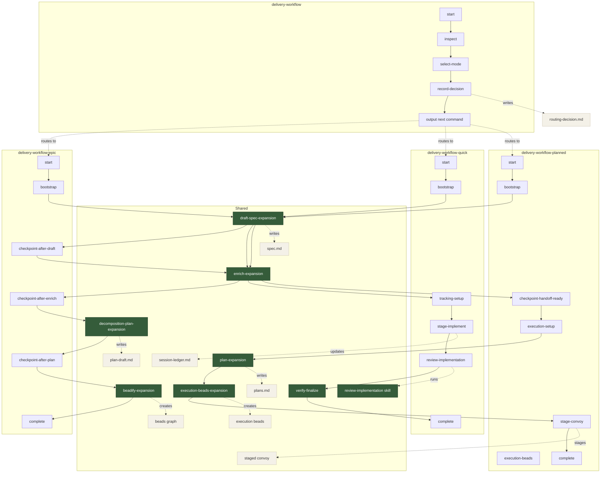

# Gas City Formulas

This directory is the currently active formula set for the local Gas City path
in this repo.

It is intentionally the older, molecule-driven workflow family restored from
`gastown/beads/formulas/`, because the newer graph.v2 / workflow-control line
is currently parked in:

- `gascity/formulas-v2/`

Use this directory for the formulas `malaz` should actually resolve today.

## Why The Rollback

The graph.v2 formula line produced correct workflow graphs, but rig-scoped
control beads were not auto-advanced by the `workflow-control` lane in real
city runs. Until that runtime/store mismatch is fixed, the graph.v2 formulas
remain quarantined.

## Active Formula Family

Spec-centric design and execution formulas for the local delivery pipeline.
Composable expansion formulas and workflow orchestrators support different
delivery modes:

- agent-driven routing into the right delivery mode
- delegation-safe umbrella decomposition (`spec -> enrich -> decomposition plan -> beadify`)
- lean single-session delivery (`spec -> enrich -> implement`)
- two-session planned delivery (`spec -> enrich || plans -> execution beads -> staged convoy`)

## Architecture

The formulas follow an **expansion/workflow pattern**:

- **Expansion formulas** (`*-expansion.formula.toml`) contain the actual multi-step logic. They use `type = "expansion"` and define `[[template]]` steps with `{target}` placeholders. Expansions run standalone (a synthetic `main` target resolves placeholders automatically) or compose into larger workflows.

- **Workflow formulas** (`*-workflow.formula.toml`) are orchestrators that compose expansion formulas into end-to-end pipelines with either handoff checkpoints or single-session continuity.

**Spec-first, adaptable execution systems:**
- `spec.md` — the durable requirements and design record
- `plan-draft.md` — decomposition plan for `delivery-workflow-epic`
- `plans.md` — milestone plan for `delivery-workflow-planned`
- Beads — either umbrella decomposition (`beadify`) or planned execution beads
- `session-ledger.md` — execution evidence for `delivery-workflow-quick`
- staged convoy — execution tracking artifact for `delivery-workflow-planned`

## The Pipeline

Six primary entry expansions, plus shared workflow support for final
verification and implementation review:

```
┌─────────────┐      ┌─────────────┐      ┌──────────────────────┐
│ Draft Spec  │ ───▶ │   Enrich    │ ───▶ │ Plan / Decompose /   │
│             │      │ (optional,  │      │ Beads                │
│ brief →     │      │  repeatable)│      │                      │
│ spec.md     │      │ spec →      │      │ spec -> plans.md /   │
│             │      │ better spec │      │ plan-draft.md / beads│
└─────────────┘      └─────────────┘      └──────────────────────┘
```

Any entry point works. Already have a spec? Skip to `plan-expansion` or
`decomposition-plan-expansion` or `beadify`. Want more rigor? Run `enrich` multiple times. Wrote the spec
yourself? Go straight to the downstream expansion you need.

## Workflow Map



---

### Draft Spec

**Formula:** `draft-spec-expansion`

Turns a brief into a first-draft spec through codebase exploration and interactive dialogue. The formula version of the [brainstorming skill](../../skills/brainstorming/SKILL.md).

**Steps:**
1. Explore codebase — dispatch agent to understand project structure, patterns, related features
2. Draft spec — ask 3-7 focused questions, propose 2-3 approaches, present design incrementally, write spec using [standard template](../docs/templates/spec.md)
3. Cleanup and commit

**Interactive:** The agent asks focused questions and proposes approaches before writing. For a more autonomous draft, provide a detailed brief.

**Input:** Feature name + brief description (1-3 sentences)
**Output:** `docs/plans/{feature}/spec.md`

**Vars:**

| Variable | Required | Description |
|----------|----------|-------------|
| `feature` | yes | Feature name (becomes directory name) |
| `brief` | yes | 1-3 sentence description of what to build |

**Usage:**
```bash
gt sling draft-spec-expansion <crew> \
  --var feature="ipv6-support" \
  --var brief="Add IPv6 CIDR block and subnet support to VPC components"
```

---

### Enrich

**Formula:** `enrich-expansion`

Reads an existing spec, uses separate slung reviewer sessions to find gaps
across 6 analytical dimensions, auto-fixes what's obvious, asks about what
needs human judgment, and folds everything back into the spec. Can be run
multiple times — each pass finds what the previous missed.

**Dimensions:**
1. **Completeness** — What's missing that would block implementation?
2. **Ambiguity** — What could be interpreted two different ways?
3. **Feasibility** — What's technically hard or impossible given the codebase?
4. **Scope** — Is the boundary clear? Is anything misplaced?
5. **Risks** — What could go wrong that isn't acknowledged?
6. **Consistency** — Does the spec contradict itself or the codebase?

**Steps:**
1. Validate spec exists with the core serialized sections and identify any missing planning sections to strengthen
2. Explore codebase — ground analysis in real code, not assumptions
3. Materialize a shared review bundle and sling 2 separate reviewers
4. Synthesize mailed review reports into `enrichment-findings.tmp`
5. Apply auto-fixes silently
6. Present decisions to human — one at a time, with options and recommendations
7. Fold answers into spec as design statements
8. Cleanup transient files and commit

**Review model:**
- reviewer A: completeness + ambiguity + scope
- reviewer B: feasibility + risks + consistency
- reviewers mail full reports back; the parent session applies fixes

**Findings are classified as:**
- **Auto-fix** — one clearly correct answer (best practice, codebase convention) → applied silently
- **Decision** — multiple valid approaches with real tradeoffs → ask the human

**Input:** `docs/plans/{feature}/spec.md` (any depth)
**Output:** Updated `docs/plans/{feature}/spec.md` (enriched)

**Vars:**

| Variable | Required | Description |
|----------|----------|-------------|
| `feature` | yes | Feature name |
**Usage:**
```bash
gt sling enrich-expansion <crew> \
  --var feature="ipv6-support"
```

---

### Decomposition Plan

**Formula:** `decomposition-plan-expansion`

Reads a cleaned umbrella spec, generates `plan-draft.md`, runs the default two
decomposition-plan review passes, and leaves behind a beadify-ready
workstream/sequencing artifact for `delivery-workflow-epic`.

**Steps:**
1. Validate spec for decomposition planning
2. Draft `plan-draft.md`
3. Review pass 1: coverage + workstream boundaries
4. Review pass 2: sequencing + cross-cutting concerns
5. Finalize plan

**Planning principles:**
- `plan-draft.md` is not a second requirements doc
- workstreams should map to coherent feature/workstream beads
- sequencing should reflect real dependencies, not arbitrary phases
- cross-cutting work should stay visible instead of disappearing between spec and beads

**Input:** `docs/plans/{feature}/spec.md`
**Output:** `docs/plans/{feature}/plan-draft.md`

**Vars:**

| Variable | Required | Description |
|----------|----------|-------------|
| `feature` | yes | Feature name |

**Usage:**
```bash
gt sling decomposition-plan-expansion <crew> \
  --var feature="ipv6-support"
```

---

### Plan

**Formula:** `plan-expansion`

Reads a cleaned spec, generates `plans.md`, runs the default two slung plan
review passes, and leaves behind a build-ready milestone plan for
`delivery-workflow-planned`.

**Steps:**
1. Validate spec for planning
2. Draft `plans.md`
3. Materialize shared review inputs and sling review pass 1: completeness + scope/constraints
4. Materialize shared review inputs and sling review pass 2: sequencing + testability/risk
5. Finalize plan

**Review model:**
- each pass slings 2 separate reviewers
- reviewers mail full reports back
- the parent session applies fixes between passes

**Planning principles:**
- `plans.md` is a milestone plan, not a second spec
- default to 3-7 milestones
- each milestone needs acceptance criteria and validation evidence
- milestone 1 should validate implementation shape for medium/large work
- add stop conditions for drift that should force re-planning

**Input:** `docs/plans/{feature}/spec.md`
**Output:** `docs/plans/{feature}/plans.md`

**Vars:**

| Variable | Required | Description |
|----------|----------|-------------|
| `feature` | yes | Feature name |

**Usage:**
```bash
gt sling plan-expansion <crew> \
  --var feature="ipv6-support"
```

---

### Execution Beads

**Formula:** `execution-beads-expansion`

Reads a finalized `plans.md`, derives execution beads from the milestone plan,
and creates the bead graph that a same-session execution skill will work
through.

**Steps:**
1. Validate `spec.md`, `plans.md`, and root epic context
2. Design execution bead graph from milestone plan
3. Create/reuse execution beads under the root epic
4. Repair dependencies and summarize the graph

**Execution-bead principles:**
- one execution bead per milestone
- explicit checkpoint beads for review-stop / shape-review milestones
- one local implementation review gate bead as the final expected execution gate
- convoy staging should use `--no-validate` for new planned-delivery runs
- bead descriptions stay concise and point back to `spec.md` / `plans.md`
- use beads for execution ownership and dependencies, not as a markdown mirror

**Input:** `docs/plans/{feature}/spec.md`, `docs/plans/{feature}/plans.md`, root epic from `session-context.md`
**Output:** Root epic child execution beads with dependency graph

**Vars:**

| Variable | Required | Description |
|----------|----------|-------------|
| `feature` | yes | Feature name |

**Usage:**
```bash
gt sling execution-beads-expansion <crew> \
  --var feature="ipv6-support"
```

---

### Beadify

**Formula:** `beadify-expansion`

The execution entry point. Reads a spec (any depth), optionally uses
`plan-draft.md`, explores the codebase, decomposes into tasks, runs 3 review
passes, and creates beads with validated dependencies.

**Steps:**
1. Validate spec exists
2. Codebase exploration — 3 parallel agents (architecture, integration surface, patterns & conventions)
3. Task decomposition — spec + optional decomposition plan + codebase analysis → `beads-draft.md` (transient)
4. Review pass 1: Completeness — every spec Design element has a task
5. Review pass 2: Dependencies — only true blockers, maximize parallelism
6. Review pass 3: Clarity — each task implementable from description alone
7. Human preview — show proposed structure, allow edits
8. Execute — create beads via `bd create` with deps
9. Cleanup transient files

**Task decomposition principles:**
- Tasks must be self-contained (implementable with zero prior context)
- Be specific, not generic (real file paths, real function signatures)
- Maximize parallelism (only add true blocking dependencies)
- Acceptance criteria must be verifiable

**Input:** `docs/plans/{feature}/spec.md` (required) and optional `docs/plans/{feature}/plan-draft.md`
**Output:** Beads epic with tasks and dependency graph

**Vars:**

| Variable | Required | Description |
|----------|----------|-------------|
| `feature` | yes | Feature name |

**Usage:**
```bash
gt sling beadify-expansion <crew> \
  --var feature="ipv6-support"
```

---

## Spec Template

All formulas produce and consume specs using the [standard template](../docs/templates/spec.md):

**Required sections:** Overview, Goals, Scope, Constraints, Acceptance Criteria, Design, Non-Negotiables, Forbidden Approaches, Decision Log, Traceability
**Optional sections:** User Stories / Scenarios, Risks, Testing, Open Questions

The format scales naturally:
- **Small work** (1-3 tasks): 10-20 lines — bullet points in Design, one-line Scope
- **Medium work** (4-10 tasks): 30-100 lines — goals, constraints, acceptance criteria, Design sub-sections, Decision Log entries
- **Large work** (10+ tasks): 100+ lines — full Design sub-sections, Decision Log, Risks, Testing, Traceability

See [docs/templates/spec.md](../docs/templates/spec.md) for the full template.
See [docs/templates/plan-draft.md](../docs/templates/plan-draft.md) for the decomposition plan template used by `decomposition-plan-expansion`.
See [docs/templates/plans.md](../docs/templates/plans.md) for the milestone plan template used by `plan-expansion`.

Related design exploration:
- [Hybrid PRD/Plan Pipeline](../../docs/plans/hybrid-prd-plan-pipeline/spec.md) — selective two-artifact model for umbrella decomposition while keeping single-spec delivery lean
- [Hybrid Formula Sketch](../../docs/plans/hybrid-prd-plan-pipeline/formula-sketch.md) — concrete stage sketch for `plan-expansion` and `delivery-workflow v2`

## Workflow Formula

### Delivery Router

**Formula:** `delivery-workflow`

Agent-driven selector for the appropriate downstream delivery workflow.

This workflow:
1. inspects the brief, repo, and existing artifacts
2. chooses a delivery mode
3. records the rationale in `routing-decision.md`
4. outputs the exact downstream `gt sling ...` command to run next

It intentionally does not try to self-launch another workflow from inside the
active router molecule; instead it finishes cleanly and tells you which
workflow to run next.

**Modes it can select:**
- `delivery-workflow-quick`
- `delivery-workflow-planned`
- `delivery-workflow-epic`

**Usage:**
```bash
gt sling delivery-workflow <crew> \
  --var feature="ipv6-support" \
  --var brief="Add IPv6 CIDR block and subnet support to VPC components"
```

---

### Epic Delivery

**Formula:** `delivery-workflow-epic`

Composes the umbrella-side expansion formulas into the full pipeline with
checkpoints between stages. Use this for initiatives that need to be broken
into feature/workstream beads, not for normal single-feature delivery.

```
Kickoff → Draft Spec → [checkpoint] → Enrich → [checkpoint] → Decomposition Plan → [checkpoint] → Beadify → Complete
```

Checkpoints support crash recovery and session handoffs — if a session ends mid-workflow, the next session picks up at the last checkpoint.

The intended output granularity is:
- one bead per coherent feature or workstream
- one integration/final-validation bead where needed
- not implementation-ready microtasks

Artifacts produced:
- `docs/plans/{feature}/spec.md`
- `docs/plans/{feature}/plan-draft.md`
- beads epic with feature/workstream beads and dependency graph

Those resulting beads are expected to kick off `delivery-workflow` (the router)
or one of the concrete delivery workflows rather than be coded directly from the
umbrella workflow.

**Vars:**

| Variable | Required | Description |
|----------|----------|-------------|
| `feature` | yes | Feature name |
| `brief` | yes | 1-3 sentence description |
**Usage:**
```bash
gt sling delivery-workflow-epic <crew> \
  --var feature="ipv6-support" \
  --var brief="Add IPv6 CIDR block and subnet support to VPC components"
```

---

### Delivery Workflow Quick

**Formula:** `delivery-workflow-quick`

Single uninterrupted Codex session from plan through implementation, shared
implementation review, and verification.
No polecat delegation. Keeps Gastown visibility through the root epic only.

```
 Kickoff -> Bootstrap -> Draft Spec -> Enrich -> Tracking Setup -> Implement -> Implementation Review -> Verify + Finalize
```

Use this when context continuity matters more than parallel delegation.

This workflow is a molecule. Treat `bd mol current <molecule-id>` as the only
authority for the next action: execute exactly the current wisp, close it, then
re-run `bd mol current` before doing anything else. Do not work ahead based on
the expected stage order.

**Vars:**

| Variable | Required | Description |
|----------|----------|-------------|
| `feature` | yes | Feature name |
| `brief` | yes | 1-3 sentence description |
| `epic_id` | no | Existing root epic to reuse |

**Usage:**
```bash
gt sling delivery-workflow-quick <crew> \
  --var feature="ipv6-support" \
  --var brief="Add IPv6 CIDR block and subnet support to VPC components"
```

---

### Delivery Workflow Planned

**Formula:** `delivery-workflow-planned`

Recommended default delivery workflow when discovery is noisy and you want the
build session to start fresh from committed artifacts, but want execution to
move into beads plus staged convoy tracking instead of staying inside the
formula.

Session 1:
- Bootstrap
- Draft Spec
- Enrich
- Handoff boundary

Session 2:
- Execution Setup
- Plan (`plans.md`)
- Create execution beads
- Stage execution convoy
- Hand off to `$epic-delivery` in the same session

```
 Kickoff -> Bootstrap -> Draft Spec -> Enrich -> [handoff] -> Execution Setup -> Plan -> Execution Beads -> Stage Convoy -> Complete
```

Use this when:
- session 1 includes a lot of brainstorming, web research, prototypes, or
  exploration noise
- you want `enrich` to distill that into a clean `spec.md`
- you want 2 default plan review passes before code starts
- you want implementation to be driven from execution beads rather than from the formula

**Vars:**

| Variable | Required | Description |
|----------|----------|-------------|
| `feature` | yes | Feature name |
| `brief` | yes | 1-3 sentence description |
| `epic_id` | no | Existing root epic to reuse |

**Usage:**
```bash
gt sling delivery-workflow-planned <crew> \
  --var feature="ipv6-support" \
  --var brief="Add IPv6 CIDR block and subnet support to VPC components"
```

**How to run Session 1 / Session 2**

The intended boundary is after `enrich`, at the workflow checkpoint step.

Session 1:
1. Start the workflow normally.
2. Run through bootstrap, draft-spec, and enrich.
3. At `checkpoint-handoff-ready`, verify the spec is ready to hand off.
4. Close that checkpoint step.
5. Run `gt handoff` to end the session.

Session 2:
1. Start a fresh crew session as normal.
2. Run `gt prime`.
3. Check the hooked molecule with `gt mol status`.
4. Run `bd mol current <molecule-id>`.
5. Continue from the next step, which should be `stage-execution-setup`.

This is an operational boundary, not a special workflow pause primitive. The
resume behavior relies on the normal hooked molecule flow: close the current
step, hand off, then let the next session resume the next current step.

When the workflow completes, execution no longer lives in the formula. The next
step is to use `$epic-delivery` to work the staged convoy and close the
execution beads in the current session.

---

## Review Worker Formula

### Implementation Review Worker

**Formula:** `mol-review-implementation`

Single-reviewer implementation-vs-spec audit. Intended to be slung once per
runtime and once per review lens, with parent-side synthesis handled by the
calling workflow.

Use this as the autonomous review worker for the final stage of
`delivery-workflow-quick`, `delivery-workflow-planned`, or other Codex-native
workflows that want a
structured review artifact without a human-interactive skill session.

**Review model:**
- Core categories stay fixed: completeness, quality, scope, standards
- `categories` should usually stay `all`
- Domain expertise is applied through `review_profile`, not new categories
- One run writes one shared report artifact
- Report artifacts belong under rig-root `.runtime/reviews/...`, not in the
  polecat's repo clone
- Review workers are report-only tasks and should not commit review artifacts

**Typical usage:**
```bash
gt sling mol-review-implementation <target> --agent codex \
  --var feature="ipv6-support" \
  --var reviewer_label="codex" \
  --var spec_scope="/Users/chall/gt/toolkit/.runtime/reviews/ipv6-support/run-001/spec.md" \
  --var impl_scope="integration/ipv6-support" \
  --var categories="all" \
  --var review_profile="general" \
  --var output_path="/Users/chall/gt/toolkit/.runtime/reviews/ipv6-support/run-001/codex-review.md"
```

**Vars:**

| Variable | Required | Description |
|----------|----------|-------------|
| `feature` | yes | Feature name |
| `reviewer_label` | yes | Label for this reviewer run |
| `spec_scope` | yes | Spec or planning scope to review |
| `impl_scope` | yes | Implementation scope to review |
| `categories` | no | Review dimensions; defaults to `all` |
| `review_profile` | no | Domain lens; defaults to `general` |
| `output_path` | yes | Shared absolute output path for the review report |

The intended default final-review stack is:
- general Codex review
- general Claude review
- optional specialist review when domain fit is strong

---

## Design Principles

**Spec-first:** `spec.md` remains the source of truth for requirements,
constraints, and decision history. Additional planning artifacts should stay
focused on execution structure, not duplicate the spec.

**Composable capabilities:** Each formula is a standalone building block. Run
one, run several, or compose into the workflow that fits the delivery mode
(umbrella decomposition, single-session delivery, or two-session delivery).

**Selective planning artifacts:** Use `plans.md` when it buys cleaner build
execution. Do not force a heavyweight planning document on every workflow.

**Signal over noise:** `enrich` uses 6 analytical dimensions that surface real
gaps, not exhaustive question generation. Auto-fix what's obvious, ask only
about genuine decisions.

**Clean session boundaries:** When discovery is noisy, split after `enrich` so
the build session starts from committed artifacts rather than exploratory chat
history or prototype code.

**Flexible entry points:** Have a brief? Run `draft-spec`. Already have a spec?
Skip to `plan-expansion` or `beadify`. Want more rigor? Run `enrich` again.
Any entry, any exit.
